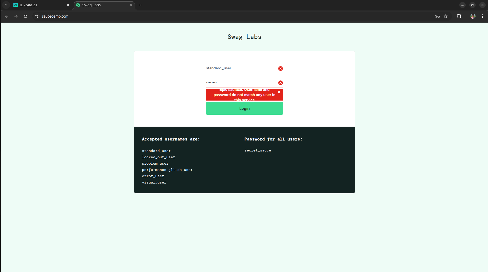

# Баг-репорт

<table border="5">
    <thead>
        <tr>
    </thead>
    <tbody>
        <tr>
            <td align="center"><strong>ID
            <td align="left"> BUG-0001
        <thead>
        <tr>
    </thead>
    <tbody>
        <tr>
            <td align="center"> <strong>Заголовок
            <td align="left"> Функционал сортировки не работает. Ошибка: "Sorting is broken! This error has been reported to Backtrace".
        </tr>
        </thead>
    <tbody>
        <tr>
            <td align="center"> <strong>Описание
            <td align="left"> После авторизации пользователя <code>error_user</code> на странице <a href="https://www.saucedemo.com/inventory/" target="_blank">https://www.saucedemo.com/inventory/</a> не работает функционал сортировки продукции по названию или стоимости. Вывод ошибки "Sorting is broken! This error has been reported to Backtrace".
        </tr>
        </thead>
    <tbody>
        <tr>
            <td align="center"> <strong>Шаги воспроизведения
            <td align="left">1. Перейти на сайт <a href="https://www.saucedemo.com/" target="_blank">https://www.saucedemo.com/</a>
 2. Ввести логин: <code>error_user</code>.
 3. Ввести пароль: <code>secret_sauce</code>.
 4. Нажать кнопку "Login".
 5. Выполнить сортировку по названию: "Name (A to Z)" или по цене: "Price (low to high)", или "Price (high to low)".
</tr>
        </thead>
    <tbody>
        <tr>
            <td align="center"> <strong>Фактический результат
            <td align="left"> Функция сортировки товаров по названию или стоимости не работает. Ошибка: "Sorting is broken! This error has been reported to Backtrace".
            </tr>
        </tr>
        </thead>
    <tbody>
        <tr>
            <td align="center"> <strong>Ожидаемый результат
            <td align="left"> Выполняется функция сортировки для товаров по названию или по цене.
            </tr>
        </thead>
    <tbody>
        <tr>
            <td align="center"> <strong>Окружение
            <td align="left"> Ubuntu 24.04.2 LTS, Google Chrome Version 136.0.7103.59
            </tr>
        </thead>
    <tbody>
        <tr>
            <td align="center"> <strong>Приоритет
            <td align="left"> High
            </tr>
        </thead>
    <tbody>
        <tr>
            <td align="center"> <strong>Серьезность
            <td align="left"> Medium
            </tr>
        </thead>
    <tbody>
        <tr>
            <td align="center"> <strong>Вложения
            <td align="left"> Скриншот ошибки:
             
            </tr>
        </thead>
    <tbody>
        <tr>
            <td align="center"> <strong>Статус
            <td align="left"> Открыт (Open)
        </tr>
    </tbody>
</table>

<table border="5">
    <thead>
        <tr>
    </thead>
    <tbody>
        <tr>
            <td align="center"><strong>ID 
            <td align="left"> BUG-0002
        <thead>
        <tr>
    </thead>
    <tbody>
        <tr>
            <td align="center"> <strong>Заголовок
            <td align="left"> Дефект отображения сообщения об ошибке при неверном логине или пароле.
        </tr>
        </thead>
    <tbody>
        <tr>
            <td align="center"> <strong>Описание
            <td align="left"> При вводе неверного логина или пароля система отображает сообщение об ошибке, однако текст сообщения выходит за рамку поля сообщения, что делает сообщение нечитаемым. При сворачивание окна к минимуму дефект пропадает. Дефект проявляется в браузерах: Google Chrome и FireFox и в Google Chrome Mobile в портретной ориентации. В браузере Microsoft Edge дефект не наблюдается.
        </tr>
        </thead>
    <tbody>
        <tr>
            <td align="center"> <strong>Шаги воспроизведения
            <td align="left">1. Перейти на сайт <a href="https://www.saucedemo.com/" target="_blank">https://www.saucedemo.com/</a>.
 2. Ввести логин: <code>standard_user</code>.
 3. Ввести неверный пароль: <code>terrieca</code>.
 4. Нажать кнопку "Login".
</tr>
        </thead>
    <tbody>
        <tr>
            <td align="center"> <strong>Фактический результат
            <td align="left"> Система отображает сообщение: "Epic sadface: Username and password do not match any user in this service", которое выходит за границы красного поля.
            </tr>
        </tr>
        </thead>
    <tbody>
        <tr>
            <td align="center"> <strong>Ожидаемый результат
            <td align="left"> Система должна отобразить сообщение об ошибке "Epic sadface:  Username and password do not match any user in this service" в красном поле.
            </tr>
        </thead>
    <tbody>
        <tr>
            <td align="center"> <strong>Окружение
            <td align="left"> Ubuntu 24.04.2 LTS,  Google Chrome Version 136.0.7103.59 / FireFox Version 138.0.3 
             Android 14, Google Chrome Mobile Versio 136.0.7103.87 
             Windows 10 22H2, Microsoft Edge Version 136.0.3240.76
            </tr>
        </thead>
    <tbody>
        <tr>
            <td align="center"> <strong>Приоритет
            <td align="left"> Medium 
            </tr>
        </thead>
    <tbody>
        <tr>
            <td align="center"> <strong>Серьезность
            <td align="left"> Medium 
            </tr>
        </thead>
    <tbody>
        <tr>
            <td align="center"> <strong>Вложения
            <td align="left">  Скриншот дефекта Google Chrome в полноэкранном режиме:
              
             Скриншот дефекта Firefox в полноэкранном режиме:
              
              Скриншот дефекта Google Chrome Mobile:
              
              Отсутствие дефекта Microsoft Edge:
                   
            </tr>
        </thead>
    <tbody>
        <tr>
            <td align="center"> <strong>Статус
            <td align="left"> Открыт (Open)
        </tr>
    </tbody>
</table>
